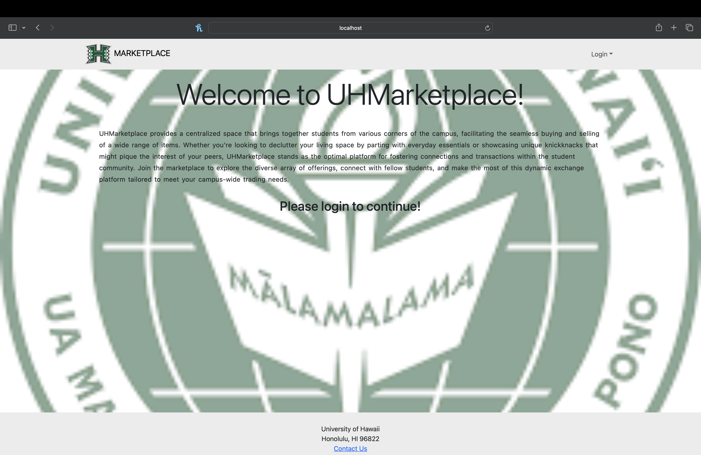
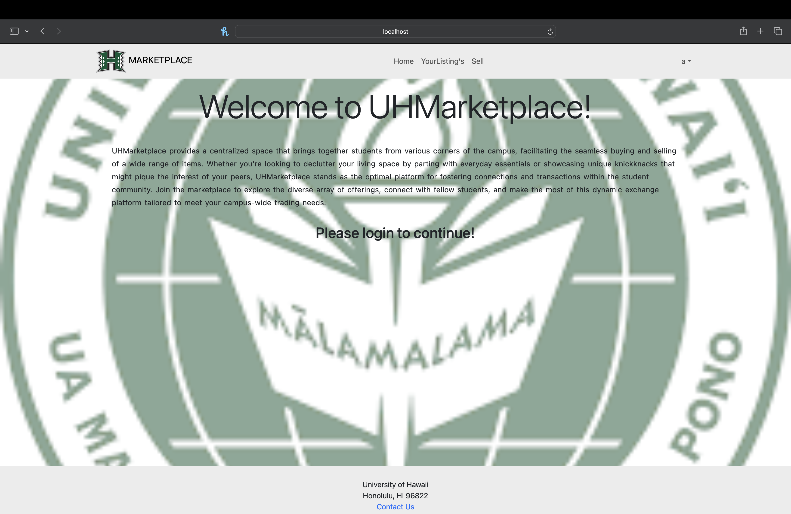
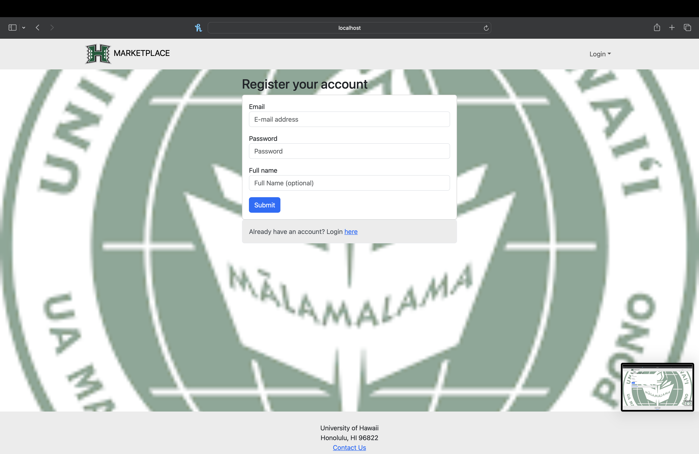
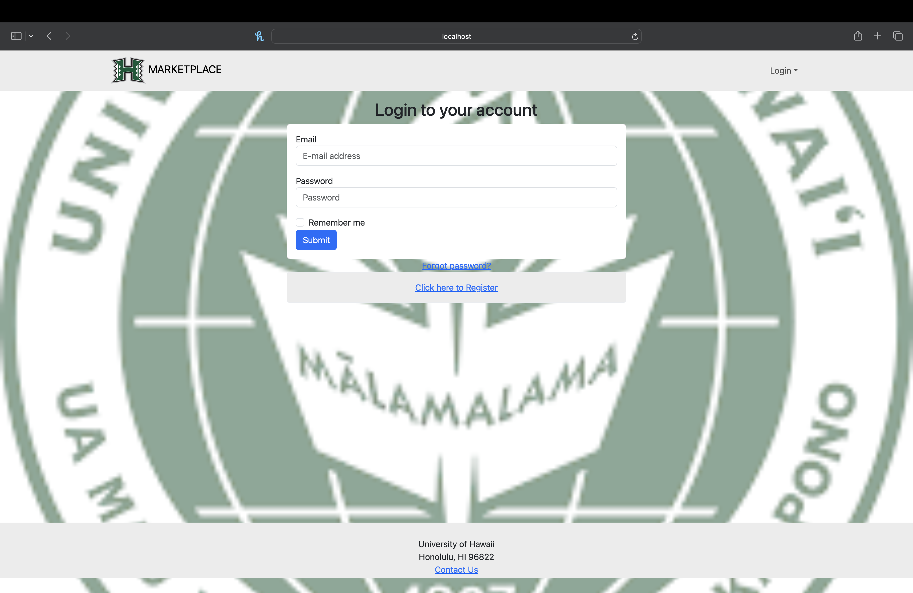
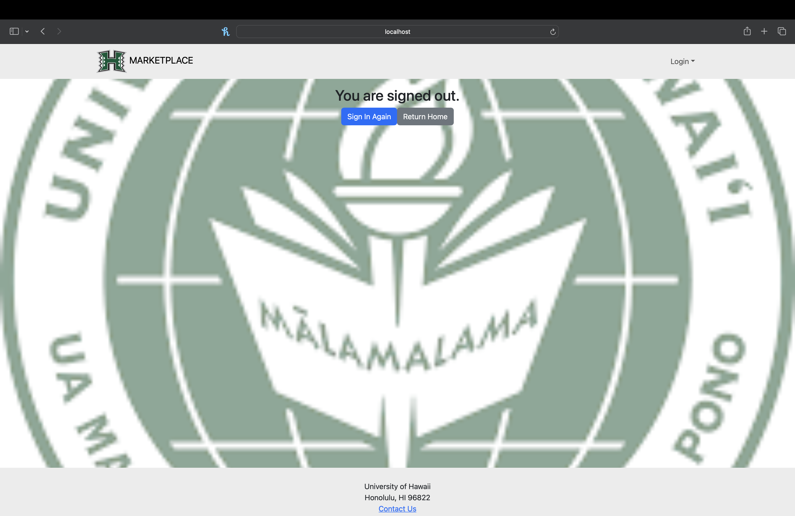
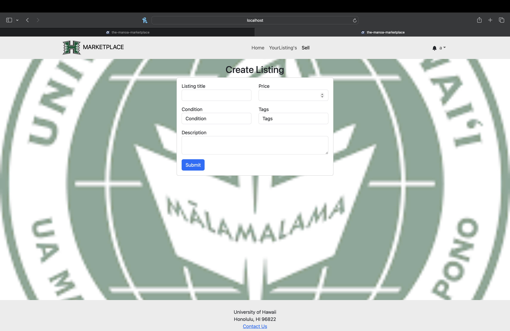
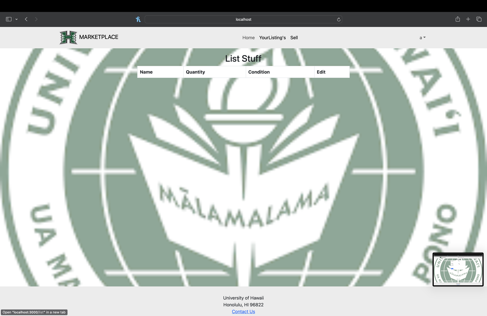
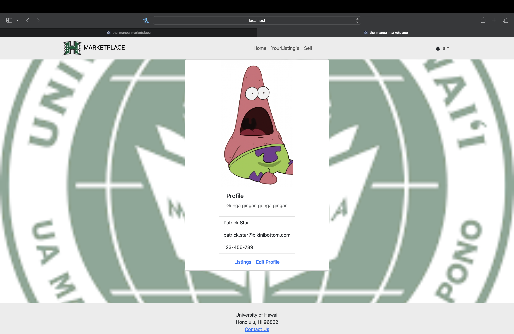

## UH Marketplace

### Overview

Spending the majority of your time on campus, whether living, working, or attending classes, results in the accumulation of various campus-specific items. This scenario has given rise to a growing demand for a platform that can facilitate the buying and selling of these goods. Introducing "uh-marketplace," a user-friendly application designed to cater to the needs of students right here at UH Manoa. For further details, please continue reading.

### Objectives/Goals

Our objective for this app is to facilitate the process of buying, selling, and even trading items at UH Manoa, making it easier than ever before. By doing so, we aim to help people save money, prevent items from going to waste, and enable them to earn back some of their expenses. Given the ever-changing population of students at UH Manoa, this app has the potential to benefit a wide range of people.

### What we offer

We offer a way for students to buy/sell items. The marketplace is open for everyone to explore, allowing easy navigation through a search bar and a selection of pre-made filters. However, enhanced functionality becomes accessible when users log in as a "User" (specifically UHM students). As registered Users, individuals gain the ability to not only browse the marketplace but also delve into seller profiles, which display the user's listed items and their respective ratings. Moreover, Users can take actions such as ordering, making offers, and purchasing goods directly from the marketplace. They can also create listings for items they wish to sell. Additionally, Users have the option to report other users or specific items on the marketplace that may violate guidelines. Administrators possess the authority to remove items from the marketplace if they are deemed unsafe, inappropriate, or illegal, ensuring a safe and reliable environment for all users.

### Deployment

You can access our deployed application running on Digital Ocean <a href="http://147.182.200.255/">here</a>

### Landing Page
This is the first page anyone can view as they are viewing our website. It prompts the user to login if they want to continue.

#### Not Logged In

If the user is not logged in, then you will have limited access to the website. You can only view the landing page.

#### Logged In

If the user is logged in then you will have more access to the website. A nav bar will appear with "Sell" and "My Listings" option.

### Sign Up Page

If users dont have an account they can sign up through this page.

### Login Page

Users can login through their account through this page.

### Sign Out

This page is showing the user what happens after logging out.

### Sell Page

This page is where you can list your own items to be sold.

### Your Listings Page

This page is where you can see your own items being sold.

### Profile Page

This page is where you can visit your profile.

### Milestone 1 - <a href="https://github.com/orgs/the-manoa-marketplace/projects/1/views/3">Basic Needs</a>

### Milestone 2 - <a href="https://github.com/orgs/the-manoa-marketplace/projects/2">Fixes and overall improvement</a>

### Milestone 3

### Members
UH Marketplace was created by 
Ryne Stagen, 
Zachary Stoddard,
Elijah Inofinada,
Brandon Underwood,
Mark Posey,
All members created and agreed to the terms of <a href="https://docs.google.com/document/d/1hA1DgIcQTYfmhvpeaGIpJnZtc9JGGncrJdrkwGfT2AQ/edit">Contract</a>

